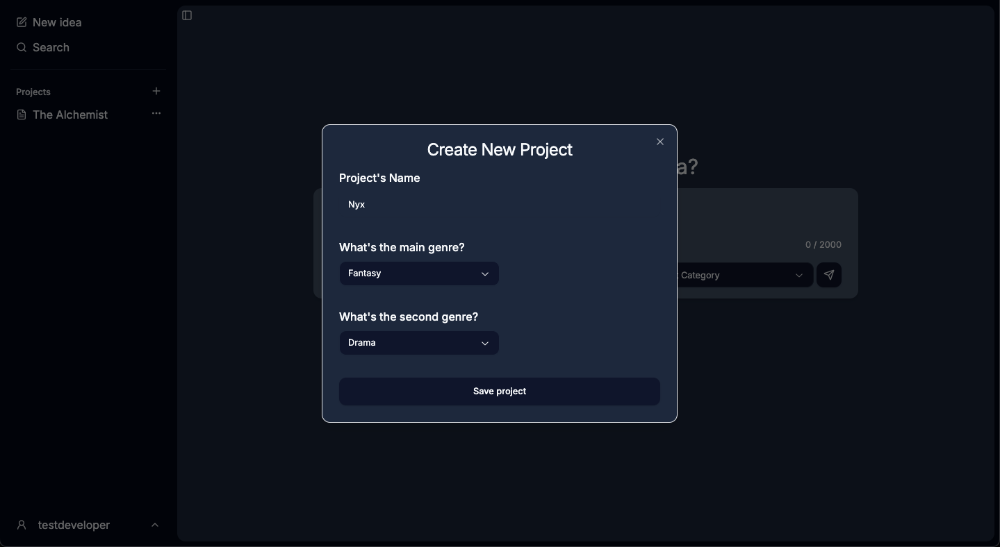
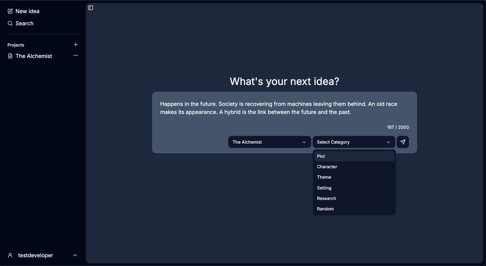
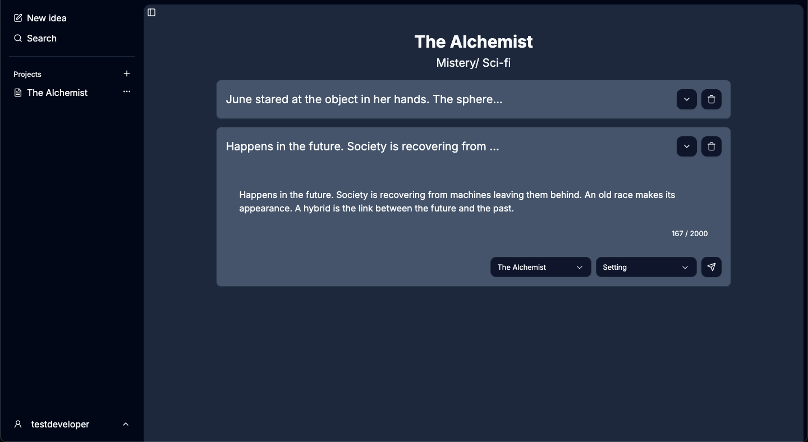

# From Storytelling to Software: Building a Tool for Fiction Writers

I got into software development because I wanted to explore how technology could enhance creativity. Is there a different way to tell stories that we haven't discovered yet? Could we use technology to free up mental bandwidth, giving creators more time to wander, explore, and develop better ideas?

As a storyteller myself, I used to have notebooks filled with fiction ideas that led nowhere. And as a book editor, I saw new authors struggling with the fundamentals of storytelling. So, I asked myself: what if the solution lay in range and automated recommendations?

- **Range**: Exploring the world in such a way that ideas from different domains spark fiction stories.
- **Automated Recommendations**: Could my editorial experience be coded into a tool that helps writers shape their narratives?

## Building the First Prototype

I started with a simple note-taking app. After all, ideas are the raw material for everything else I wanted to explore. It took me six months of false starts, reading, searching, and using LLMs to understand the fundamentals and build something I liked.

Those six months were also enough to introduce me to the concept of a second brain—a system for organizing and retrieving ideas. I also realized that the scope of my app would eventually keep me from learning new things. But as a learning tool, this project had served its purpose: it proved that software could indeed play a role in helping writers tell better stories.

This project also led me to a new realization: I want to **dive deeper into AI engineering** and explore how LLMs, combined with my full-stack development knowledge, could help build the next generation of creative tools.

## Technical Lessons & Challenges

1. ### Building an Intuitive Writing Experience

- Instead of building a headless rich text editor from scratch, I integrated Tiptap, adapting a minimal editor to create an intuitive note-taking interface. My goal was to mimic the writing experience of Notion or Kortex while keeping it distraction-free ([here](https://github.com/Aslam97/shadcn-minimal-tiptap/tree/main) is the repository I used.)
- I implemented a 2,000-character limit to encourage quick brainstorming. This app wasn't about drafting novels—it was about capturing fleeting story ideas before they disappeared.

2. ### Full-Text Search for Writers

- I used PostgreSQL's full-text search via Django to allow users to find ideas using keywords or categories. If a writer added hundreds of ideas, they needed a quick way to retrieve them.
- While a robust search feature was useful, it didn’t fully solve the problem I set out to address. This was another reason I decided to move on: I wanted to explore how LLMs could surface relevant but unexpected connections rather than rely on rigid keyword searches.

3. ### Authentication & Security—The Final Roadblock

- I implemented JWT and OAuth using Simple JWT and Djoser for authentication. On the frontend, I refactored API calls using RTK Query and Redux, restructuring them into API slices.
- The final challenge was handling session cookies to restrict access to authorized users. Understanding authentication flow turned out to be more complex than I expected.

4. ### Deployment & Constraints

- I deployed the app using Render’s free web service, which introduced **high latency (2-5 min server startup time)**. A poor user experience, but a reasonable tradeoff for a zero-cost project.
- Deployment issues arose from environment variable typos and database schema mismatches—a bigint-to-UUID error in authentication tables blocked user logins. Debugging this was frustrating but gave me firsthand experience in troubleshooting production environments.

### Tech Stack

### Github Repositories

- [Frontend Repository](https://github.com/inatgomez/dens-front-end.git)
- [Backend Repository](https://github.com/inatgomez/dens-api.git)
- Deployed site: Closed

## Gallery

**Create a project form**

**Add an idea chat like interface**

**Ideas list inside specific project**

